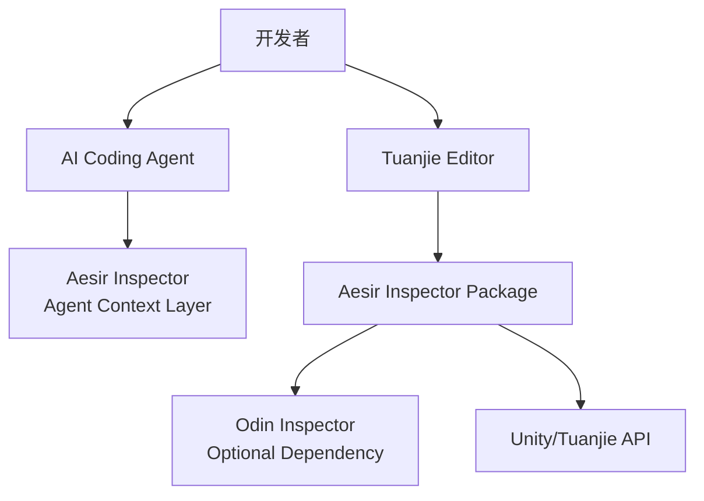
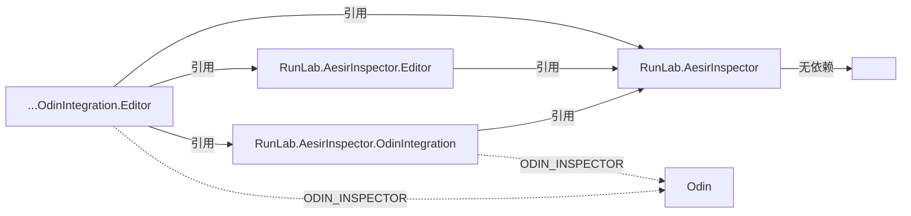
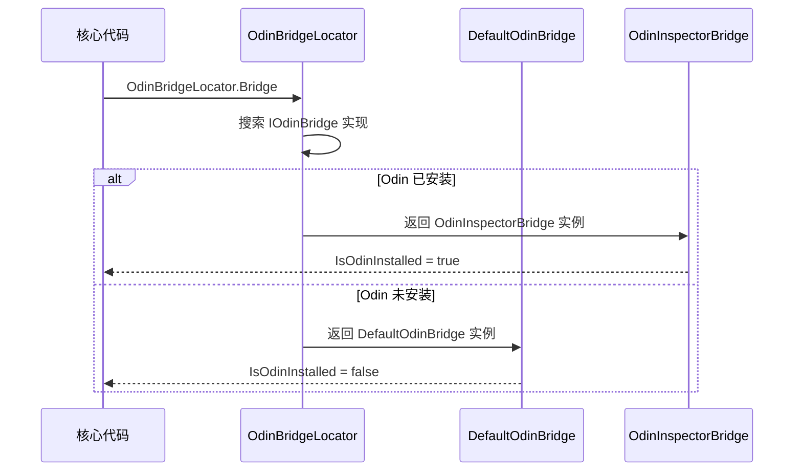
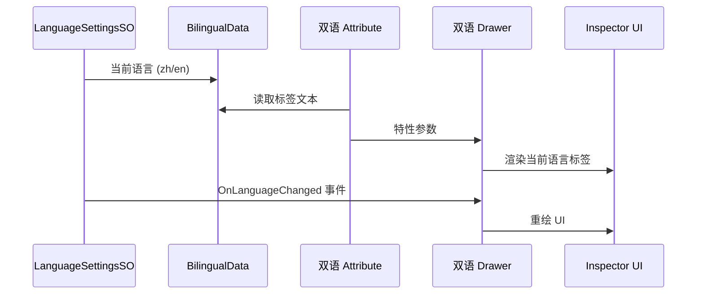

# Development Guide

> Aesir Inspector 开发者指南。架构、模块、决策记录与任务操作参考。
> 编码规范见 [CODELY.md](./CODELY.md)，本文件不再重复。

---

## Odin Inspector 版本策略

本项目基于 Odin Inspector **最新稳定版**持续集成，当前基线 **4.0.1.x**（含 Visual Designer + OVDF v1.1）。

| 策略 | 说明 |
|------|------|
| **持续跟进** | 每个 Odin 稳定版发布后，在兼容性验证通过的前提下升级项目基线 |
| **兼容性底线** | Odin 4.0+（Visual Designer 引入版本），低于此版本时 OdinIntegration 程序集仍可编译但 Visual Designer 不可用 |
| **OVDF 格式** | 使用 v1.1 格式（Odin 4.0.1.2+），支持 GUID 类型追踪和 `FormerlySerializedAs` |
| **版本变更记录** | 基线升级时更新本文件、CODELY.md、CONTRIBUTING.md 及用户文档中的版本号 |

---

## Architecture

### System Context

### Assembly Dependency

### OdinBridge Data Flow

### Bilingual System Data Flow

---

## Modules

### Runtime/Unity/ — Core Runtime

| Component | Directory | Key Types |
|-----------|-----------|-----------|
| Attributes | `Attributes/` | `SummaryAttribute` |
| Core | `Core/` | `AesirInspectorVersion`, `AesirInspectorPaths`, `AesirInspectorWebLinks`, `IAesirInspectorReset` |
| Inspector | `Inspector/` | `BilingualDisplayAsStringControl`, `BilingualHeaderControl`, `HorizontalSeparateControl` |
| Localization | `Localization/` | `BilingualData`, `AesirInspectorLanguageSettingsSO` |
| Logging | `Logging/` | `AesirInspectorLogger`, `AesirInspectorLoggerSettings` |
| OdinBridge | `OdinBridge/` | `IOdinBridge`, `DefaultOdinBridge`, `OdinBridgeLocator` |
| ScriptDocGenerator | `ScriptDocGenerator/` | `ITypeData`, `MemberData`, `FieldData`, `PropertyData`, `MethodData`, `ConstructorData`, `EventData`, `ParameterData`, `TypeData` |
| Utilities | `Utilities/` | `ScriptableObjectSafeEditorUtility`, `MonoScriptSafeEditorUtility`, `PathUtility`, `PathSafeEditorUtility`, `HierarchyUtility`, `HierarchySafeEditorUtility`, `ProjectSafeEditorUtility`, `UrlUtility`, `ReflectionUtility`, `PredefinedAssemblyUtility`, `PlayerLoopUtility`, `RegexUtility` |

### Editor/Unity/ — Core Editor

| Component | Directory | Key Types |
|-----------|-----------|-----------|
| Core | `Core/` | `InstallationChecker`, `AesirInspectorMenuItems` |
| MiniTools | `MiniTools/` | `QuickCreateSOMenuItem` |
| SummaryTool | `SummaryTool/` | `XmlSummaryTool`, `XmlCodePart`, `SummaryToolMenuItems` |

### Runtime/Odin Integration/ — Odin Runtime

| Component | Directory | Key Types |
|-----------|-----------|-----------|
| Attributes | `Attributes/` | `BilingualTitleAttribute`, `BilingualButtonAttribute` 等 4 个双语特性 |
| OdinCodeHighlighter | `OdinCodeHighlighter.cs` | 语法高亮器运行时数据 |

### Editor/Odin Integration/ — Odin Editor

| Component | Directory | Key Types |
|-----------|-----------|-----------|
| AttributeOverviewPro | `AttributeOverviewPro/` | Data-Panel-Example 三件套架构 |
| AttributeProcessors | `AttributeProcessors/` | OdinAttributeProcessor 实现 |
| Bridge | `Bridge/` | `OdinInspectorBridge` |
| Drawers | `Drawers/` | 4 个双语 Drawer |
| ExtensionManager | `ExtensionManager/` | 一键安装/移除推荐包 |
| MiniTools | `MiniTools/` | MenuItem Viewer, Syntax Highlighter |
| ScriptDocGenerator | `ScriptDocGenerator/` | 文档生成器编辑器逻辑 |
| Visual Designer | `Visual Designer/Saved/` | OVDF 持久化文件 |
| Windows | `Windows/` | Getting Started, Preferences |

---

## Architecture Decisions

### ADR-001: OdinBridge Separation

核心运行时通过 `IOdinBridge` 接口查询 Odin 可用性，不直接引用 Odin 类型。无 Odin 时 `DefaultOdinBridge` 提供默认实现，有 Odin 时 `OdinInspectorBridge` 提供增强实现。

Consequences

**优点**：
- 核心程序集零 Odin 依赖，可在无 Odin 环境下独立运行和分发
- Odin 集成通过编译约束独立启用/禁用，无需条件编译指令散落各处
- 新的编辑器增强只需实现 `IOdinBridge`，不影响核心稳定性

**缺点**：
- 新增 Odin 特性时需同时修改 Bridge 接口和两个实现类，维护成本增加
- 通过接口间接调用存在微小的性能开销（Inspector 场景下可忽略）
- Bridge 接口变更会同时影响两个实现，需注意向后兼容

### ADR-002: Bilingual Attribute + Drawer Separation

Attribute 只承载数据，Drawer 负责渲染逻辑，Processor 负责动态注入。新增双语特性只需创建 Attribute + Drawer（+ 可选 Processor）。

Consequences

**优点**：
- 关注点分离：数据、渲染、注入各司其职，单一职责明确
- 扩展性强：新增双语特性只需 2-3 个文件，无需修改已有代码
- Drawer 可独立测试渲染逻辑，不依赖 Odin Attribute 的数据定义

**缺点**：
- Attribute 和 Drawer 之间通过泛型参数 `TAttribute` 耦合，重命名 Attribute 需同步修改 Drawer
- Processor 与被处理类同文件定义，文件可能变大（但保证了查找便利性）
- 双语文本需在 Attribute 中同时维护中英两套，数据冗余

### ADR-003: Core/Integration Assembly Separation

核心程序集（`Runtime/Unity/`、`Editor/Unity/`）零 Odin 依赖；Odin Integration 程序集通过 `ODIN_INSPECTOR` 编译约束自动启用/禁用。

Consequences

**优点**：
- 核心程序集可在任何 Unity/Tuanjie 项目中使用，无需 Odin 授权
- `ODIN_INSPECTOR` 编译约束确保 Odin 代码不会在无 Odin 环境下编译报错
- 程序集边界清晰，依赖方向单向（Integration → Core），避免循环引用

**缺点**：
- 核心功能若需 Odin 增强，必须通过 Bridge 模式间接调用，增加间接层
- 4 个程序集增加了项目结构和 asmdef 文件的复杂度
- 新增跨程序集的功能时，需考虑代码应放在 Core 还是 Integration

### ADR-004: SafeEditorUtility Pattern

Runtime 工具类使用 `XxxSafeEditorUtility` 模式：`void` 方法加 `[Conditional("UNITY_EDITOR")]`，有返回值方法用 `#if UNITY_EDITOR` 双实现。构建时自动剔除，零运行时开销。

Consequences

**优点**：
- Runtime 工具类可安全引用 Editor API，构建时自动剔除，零运行时开销
- `[Conditional]` 标记的 `void` 方法调用在非 Editor 构建中完全移除，包括参数评估
- 双实现模式（`#if UNITY_EDITOR`）确保有返回值的方法在构建时提供安全的默认值

**缺点**：
- 同一功能需维护两份实现（Editor 实现 + 构建时的默认值），代码重复
- `[Conditional]` 方法中的副作用在构建时会被静默移除，可能隐藏逻辑错误
- 命名约定需严格遵守（`XxxSafeEditorUtility`），违反约定可能导致构建失败

### ADR-005: Pragmatic SOLID — 务实的 SOLID 原则

本项目遵循 SOLID 原则，但**不过度抽象**。每一层抽象都必须有明确的理由：有真实的替换者、有用户的扩展场景、有架构上的必要（如跨程序集依赖方向）。没有当前替换者的内部逻辑直接编写具体类。详细规范见 [CODELY.md](./CODELY.md) 的 "SOLID Principles" 和 "抽象决策清单" 章节。

Consequences

**优点**：
- 用户可在真实扩展点注入自定义行为（如 `IAssemblyFilter`、`IOdinBridge`）
- 代码结构简洁，没有"可能有用"的接口层增加理解成本
- 每个抽象的存在理由可追溯，新开发者能快速判断是否需要新增抽象

**缺点**：
- 当新的扩展需求出现时，可能需要重构已有代码以引入抽象（但这是可接受的——YAGNI 优于过早抽象）
- 判断"是否需要抽象"依赖对用户场景的理解，可能因预判不足而遗漏扩展点

---

## Task Guides

### Add Bilingual Attribute

1. **Attribute**: `Runtime/Odin Integration/Attributes/Bilingual{Name}Attribute.cs` — 命名 `Bilingual{OdinOriginalName}Attribute`，必须 `[DontApplyToListElements]`，公共类必须 `[Summary]`，禁止 XML 注释
2. **Drawer**: `Editor/Odin Integration/Drawers/Bilingual{Name}AttributeDrawer.cs` — 继承 `OdinAttributeDrawer<TAttribute>`，读取 `AesirInspectorLanguageSettingsSO.CurrentLanguage`，无需 XML / `[Summary]`
3. **Processor** (可选): 与被处理类同文件，`internal sealed`，无需 XML / `[Summary]`
4. **AttributeOverviewPro** (可选): 创建 Data-Panel-Example 三件套

### Add Inspector Control

1. **文件**: `Runtime/Unity/Inspector/{Name}Control.cs`
2. **命名**: `{Purpose}Control`
3. **双语**: 使用 `BilingualData` + `AesirInspectorLanguageSettingsSO.CurrentLanguage`
4. **Editor 功能**: 通过 `SafeEditorUtility` 模式桥接

### Add Odin Drawer

1. **文件**: `Editor/Odin Integration/Drawers/{Name}Drawer.cs`
2. **继承**: `OdinAttributeDrawer<TAttribute>`
3. **双语**: 通过 `AesirInspectorLanguageSettingsSO` 获取当前语言，订阅 `OnLanguageChanged` 事件
4. **无需** XML / `[Summary]`

### Add OdinAttributeProcessor

1. **位置**: 与被处理类**同文件**，`internal sealed`
2. **无需** XML / `[Summary]`
3. **需 `nameof` 引用私有成员**: 定义为**嵌套类**（仍 `internal`）
4. **隐藏条件属性命名**: 集合为空 `{FieldName}IsEmpty`，对象为空 `{Target}IsNull`

### Add Utility

1. **Runtime 工具**: `XxxUtility` → `Runtime/Unity/Utilities/`
2. **Editor 安全封装**: `XxxSafeEditorUtility` → `Runtime/Unity/Utilities/`
3. **Editor-Only**: `XxxEditorUtility` → `Editor/Unity/`
4. **必须** `public static class`，私有方法加 `Internal_` 前缀
5. 日志使用 `AesirInspectorLogger`，Odin 操作通过 `OdinInspectorSafeEditorUtility` 桥接

### Modify OVDF (Visual Designer 持久化文件)

OVDF 文件通常由 Visual Designer 自动管理，手动编辑仅限类型/字段重命名后的同步修正。详细规范见 [ovdf-format.md](./ovdf-format.md)。

1. **确认影响范围**：检查目标类型是 MonoBehaviour/ScriptableObject（v1.1 GUID 追踪）还是普通 Serializable 类（仅类型名解析）
2. **类型/命名空间/程序集变更**（普通 Serializable 类）：编辑 OVDF 第 2 行 `FullTypeName, AssemblyName`
3. **字段重命名**：在 C# 中添加 `[FormerlySerializedAs("oldName")]`，OVDF 中 `# {fieldName}` 节点会在下次 Visual Designer 保存时自动更新
4. **验证**：在 Designer Files Overview (Tools → Odin → Inspector → Designer Files Overview) 中确认无错误
5. **禁止**：不要在 Odin 默认路径和包内路径各保留一份 OVDF，只保留 `Editor/Odin Integration/Visual Designer/Saved/` 下的版本
