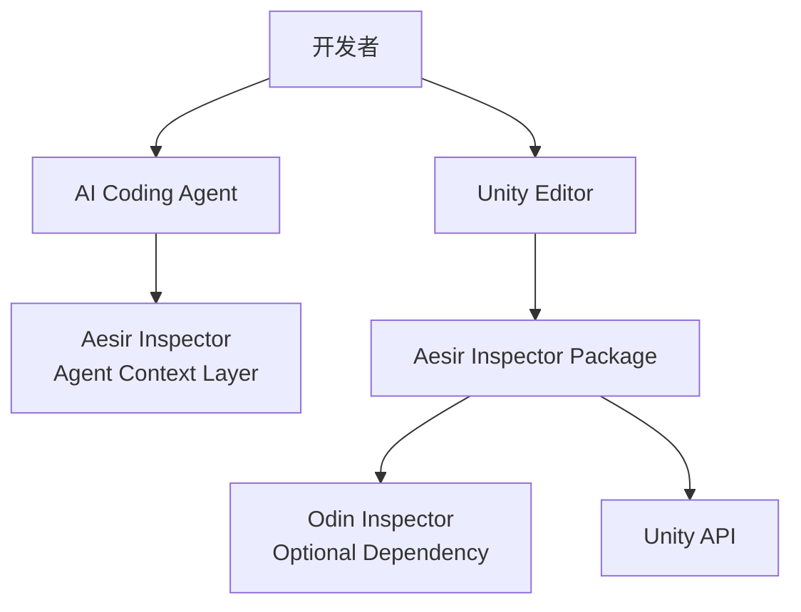
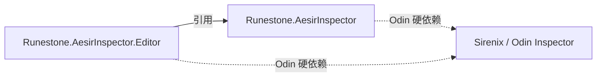
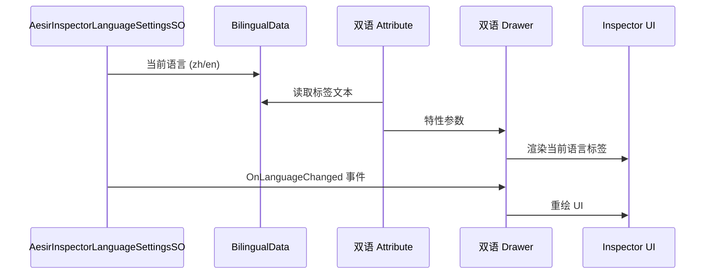

# Development Guide

> Aesir Inspector 开发者指南。面向 AI Agent 和贡献者的架构、约定与操作参考。

---

## Architecture

### System Context



### Assembly Dependency



### Odin Hard Dependency

Odin Inspector 是硬依赖：程序集不设 `defineConstraints`，代码直接使用 Sirenix API，不保留任何 `#if ODIN_INSPECTOR` 条件编译分支。未安装 Odin Inspector 时编译失败，属于预期行为。

- Runtime 程序集 `Runestone.AesirInspector` 使用 `Sirenix.Utilities` 等运行时 API。
- Editor 程序集 `Runestone.AesirInspector.Editor` 额外使用 `Sirenix.OdinInspector.Editor`（Drawer、Processor、MenuEditorWindow）。

### Bilingual System Data Flow



---

## Conventions

### Naming

| 标识符 | 规则 | 示例 |
|---|---|---|
| 类、接口 | `PascalCase`，接口 `I` 前缀 | `PlayerManager`, `IDamageable` |
| 私有非序列化字段 | `_camelCase` | `_health` |
| 序列化字段 `[SerializeField]` | `camelCase` | `moveSpeed` |
| 常量 / 静态只读 | `PascalCase` | `MaxScore` |

### Enum

- 普通：含 `None = 0`，显式赋值。
- Flags：`[Flags]`，值为 `1 << n`，复合用 `|`。

### Unity 禁忌

- **严禁**对 `UnityEngine.Object` 派生类使用 `?.` / `??`
- **严禁**在 `Update` 中调用 `GetComponent`、`Find`、字符串拼接、LINQ

### Events

| 角色 | 命名 | 示例 |
|---|---|---|
| 事件 | 无 `On` 前缀 | `DoorOpened` |
| 订阅方法 | `On` + 事件名 | `OnDoorOpened` |
| 触发方法 | `Raise` + 事件名 | `RaiseDoorOpened` |

### Comments

本项目采用**自文档化代码**和**无注释范式**：

- **禁止 XML 注释**：不使用 `/// <summary>`、`/// <param>` 等 XML 文档注释
- **类必须使用 `[Summary]`**：所有类（class / struct / interface）必须具备 `[Summary("...")]`，解释"为什么"
- **其他成员**：命名即文档，仅复杂逻辑使用 `[Summary]`，解释"为什么"而非"做了什么"

#### 免除规范的模块

以下模块为展示/示例用途，不适用通用注释规范，使用 `//` 单行/多行注释进行特殊性补充即可：

- `Runtime/CodeStyle/` — 代码风格示例文件
- `Editor/AttributeOverviewPro/Data/` — 属性数据类
- `Editor/AttributeOverviewPro/AttributePanels/` — Panel SO 定义
- `Editor/AttributeOverviewPro/UsageExamples/` — 示例 SO

### Methods

- `Internal_` 前缀：私有/保护/内部方法与公开方法重名时使用

### Odin Inspector 规范

- Processor：`internal sealed`，与目标类**同文件**定义，无需 XML / `[Summary]`
- Processor 需 `nameof` 引用私有成员时，定义为**嵌套类**（仍 `internal`）
- Drawer：继承 `OdinAttributeDrawer`，独立存于 `Drawers/` 目录

### Utility Naming

| 类别 | 命名规则 | 目录 | 示例 |
|---|---|---|---|
| Runtime | `XxxUtility` | `Runtime/Utilities/` | `PathUtility` |
| Editor 安全封装 | `XxxSafeEditorUtility` | `Runtime/Utilities/` | `HierarchySafeEditorUtility` |
| Editor-Only | `XxxEditorUtility` | `Editor/` | `PackageManagerEditorUtility` |

### SafeEditorUtility Pattern

```csharp
public static class XxxSafeEditorUtility
{
    // void 方法：构建剔除
    [Conditional("UNITY_EDITOR")]
    public static void PingObject(Object target) { /* Editor 实现 */ }

    // 有返回值方法：双实现
    public static bool TryGetAssetPath(Object target, out string path)
    {
#if UNITY_EDITOR
        path = AssetDatabase.GetAssetPath(target);
        return !string.IsNullOrEmpty(path);
#else
        path = default;
        return false;
#endif
    }
}
```

### Event Subscription

```csharp
// 先 - 再 +，防止重复
AesirInspectorLanguageSettingsSO.OnLanguageChanged -= Internal_OnLanguageChanged;
AesirInspectorLanguageSettingsSO.OnLanguageChanged += Internal_OnLanguageChanged;

// OnDestroy 中取消
AesirInspectorLanguageSettingsSO.OnLanguageChanged -= Internal_OnLanguageChanged;
```

---

## Modules

### Runtime/ — Runtime

| Component | Directory | Key Types |
|-----------|-----------|-----------|
| Common | `Common/` | `AesirInspectorVersion`, `AesirInspectorPaths`, `AesirInspectorWebLinks`, `AesirInspectorSettings`, `IAesirInspectorReset` |
| Debug | `Debug/` | `AesirInspectorDebug`, `AesirInspectorDebugSettings` |
| ScriptDocGenerator | `ScriptDocGenerator/` | `ITypeData`, `MemberData`, `FieldData`, `PropertyData`, `MethodData`, `ConstructorData`, `EventData`, `ParameterData`, `TypeData`, `SummaryAttribute` |
| Utilities | `Utilities/` | `ScriptableObjectSafeEditorUtility`, `MonoScriptSafeEditorUtility`, `PathUtility`, `PathSafeEditorUtility`, `HierarchyUtility`, `HierarchySafeEditorUtility`, `ProjectSafeEditorUtility`, `UrlUtility`, `ReflectionUtility`, `PredefinedAssemblyUtility`, `PlayerLoopUtility`, `RegexUtility`, `OdinCodeHighlighter` |
| CodeStyle | `CodeStyle/` | `AesirInspectorCodeStyle`（代码风格可编译示例） |
| Attributes | `Attributes/` | `BilingualTitleAttribute`, `BilingualButtonAttribute` 等双语特性 |
| Inspector | `Inspector/` | `BilingualDisplayAsStringControl`, `BilingualHeaderControl`, `HorizontalSeparateControl` |
| Localization | `Localization/` | `BilingualData`, `AesirInspectorLanguageSettingsSO` |

### Editor/ — Editor

| Component | Directory | Key Types |
|-----------|-----------|-----------|
| Core | `Core/` | `AesirInspectorInstallationChecker`, `AesirInspectorMenuItems` |
| Common | `Common/` | `AesirInspectorModuleAssetMarkerSO` |
| MiniTools | `MiniTools/` | `QuickCreateSOMenuItem`, MenuItem Viewer, Syntax Highlighter |
| AttributeOverviewPro | `AttributeOverviewPro/` | Data-Panel-Example 三件套架构 |
| AttributeProcessors | `AttributeProcessors/` | OdinAttributeProcessor 实现 |
| Drawers | `Drawers/` | 双语 Drawer |
| ExtensionManager | `ExtensionManager/` | 一键安装/移除推荐包 |
| ScriptDocGenerator | `ScriptDocGenerator/` | 文档生成器编辑器逻辑、`XmlSummaryTool`（`SummaryAttributeTool/`） |
| Windows | `Windows/` | Getting Started, Preferences |

---

## Architecture Decisions

### ADR-001: Odin Hard Dependency

Odin Inspector 是硬依赖：程序集不设 `defineConstraints`，不保留 `#if ODIN_INSPECTOR` 条件编译分支，直接使用 Sirenix API。

<details>
<summary>Consequences</summary>

**优点**：
- 无条件编译分支，代码路径单一，可读性和维护成本显著降低
- 无桥接间接层，直接调用 Odin API，无性能开销
- 依赖关系清晰：缺少 Odin 时立即编译失败，而非静默降级

**缺点**：
- 无 Odin 环境下无法编译，未安装 Odin 的项目不能使用本包
- Odin 版本升级可能带来 API 破坏性变更，需同步适配

</details>

### ADR-002: Bilingual Attribute + Drawer Separation

Attribute 只承载数据，Drawer 负责渲染逻辑，Processor 负责动态注入。新增双语特性只需创建 Attribute + Drawer（+ 可选 Processor）。

<details>
<summary>Consequences</summary>

**优点**：
- 关注点分离：数据、渲染、注入各司其职，单一职责明确
- 扩展性强：新增双语特性只需 2-3 个文件，无需修改已有代码
- Drawer 可独立测试渲染逻辑，不依赖 Odin Attribute 的数据定义

**缺点**：
- Attribute 和 Drawer 之间通过泛型参数 `TAttribute` 耦合，重命名 Attribute 需同步修改 Drawer
- Processor 与被处理类同文件定义，文件可能变大（但保证了查找便利性）
- 双语文本需在 Attribute 中同时维护中英两套，数据冗余

</details>

### ADR-003: Runtime/Editor Assembly Separation

仅保留两个程序集：`Runestone.AesirInspector`（Runtime）与 `Runestone.AesirInspector.Editor`（Editor），按 Unity 平台边界拆分，不再按 Odin 依赖拆分。

<details>
<summary>Consequences</summary>

**优点**：
- 程序集数量从 4 个减为 2 个，结构与 asmdef 维护成本降低
- 平台边界（Runtime/Editor）符合 Unity 包标准布局，依赖方向单向（Editor → Runtime）
- 命名空间与程序集一一对应（`Runestone.AesirInspector` / `Runestone.AesirInspector.Editor`），降低认知成本

**缺点**：
- Runtime 程序集包含 Odin 运行时依赖，用户项目必须安装 Odin
- 单一 Runtime 程序集体量更大，无法按模块裁剪引用

</details>

### ADR-004: SafeEditorUtility Pattern

Runtime 工具类使用 `XxxSafeEditorUtility` 模式：`void` 方法加 `[Conditional("UNITY_EDITOR")]`，有返回值方法用 `#if UNITY_EDITOR` 双实现。构建时自动剔除，零运行时开销。

<details>
<summary>Consequences</summary>

**优点**：
- Runtime 工具类可安全引用 Editor API，构建时自动剔除，零运行时开销
- `[Conditional]` 标记的 `void` 方法调用在非 Editor 构建中完全移除，包括参数评估
- 双实现模式（`#if UNITY_EDITOR`）确保有返回值的方法在构建时提供安全的默认值

**缺点**：
- 同一功能需维护两份实现（Editor 实现 + 构建时的默认值），代码重复
- `[Conditional]` 方法中的副作用在构建时会被静默移除，可能隐藏逻辑错误
- 命名约定需严格遵守（`XxxSafeEditorUtility`），违反约定可能导致构建失败

</details>

---

## Task Guides

### Add Bilingual Attribute

1. **Attribute**: `Runtime/Attributes/Bilingual{Name}Attribute.cs` — 命名 `Bilingual{OdinOriginalName}Attribute`，必须 `[DontApplyToListElements]`，公共类必须 `[Summary]`，禁止 XML 注释
2. **Drawer**: `Editor/Drawers/Bilingual{Name}AttributeDrawer.cs` — 继承 `OdinAttributeDrawer<TAttribute>`，读取 `AesirInspectorLanguageSettingsSO.CurrentLanguage`，无需 XML / `[Summary]`
3. **Processor** (可选): 与被处理类同文件，`internal sealed`，无需 XML / `[Summary]`
4. **AttributeOverviewPro** (可选): 创建 Data-Panel-Example 三件套

### Add Inspector Control

1. **文件**: `Runtime/Inspector/{Name}Control.cs`
2. **命名**: `{Purpose}Control`
3. **双语**: 使用 `BilingualData` + `AesirInspectorLanguageSettingsSO.CurrentLanguage`
4. **Editor 功能**: 通过 `SafeEditorUtility` 模式调用

### Add Odin Drawer

1. **文件**: `Editor/Drawers/{Name}Drawer.cs`
2. **继承**: `OdinAttributeDrawer<TAttribute>`
3. **双语**: 通过 `AesirInspectorLanguageSettingsSO` 获取当前语言，订阅 `OnLanguageChanged` 事件
4. **无需** XML / `[Summary]`

### Add OdinAttributeProcessor

1. **位置**: 与被处理类**同文件**，`internal sealed`
2. **无需** XML / `[Summary]`
3. **需 `nameof` 引用私有成员**: 定义为**嵌套类**（仍 `internal`）
4. **隐藏条件属性命名**: 集合为空 `{FieldName}IsEmpty`，对象为空 `{Target}IsNull`

### Add Utility

1. **Runtime 工具**: `XxxUtility` → `Runtime/Unity/Utilities/`
2. **Editor 安全封装**: `XxxSafeEditorUtility` → `Runtime/Unity/Utilities/`
3. **Editor-Only**: `XxxEditorUtility` → `Editor/Unity/`
4. **必须** `public static class`，私有方法加 `Internal_` 前缀
5. 日志使用 `AesirInspectorDebug`
