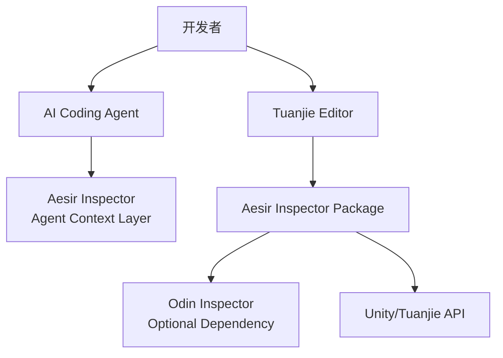
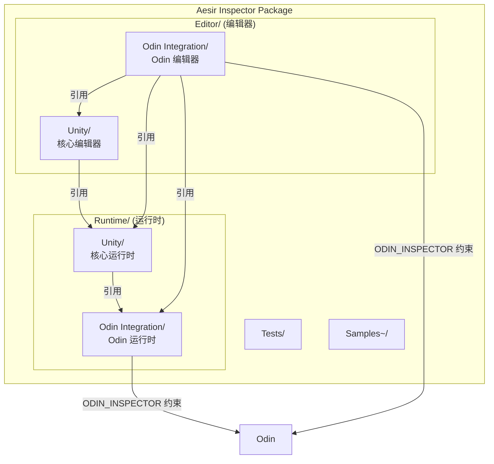
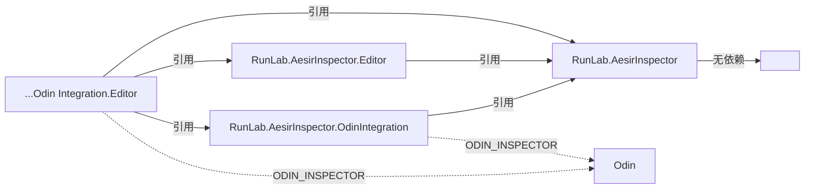
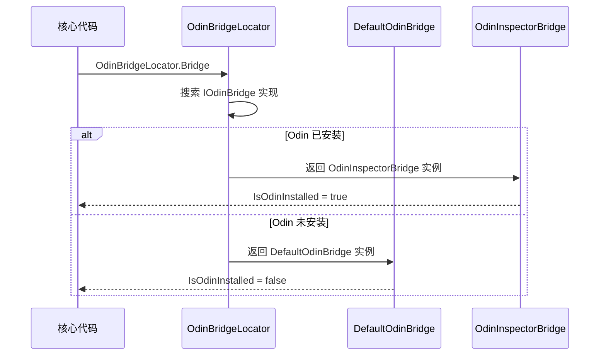
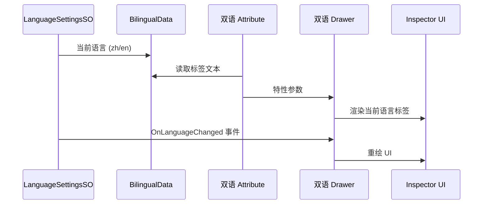

# Architecture

> Aesir Inspector 系统架构文档。基于 C4 模型，面向 AI Agent 设计。

## C1 — System Context

**外部系统**：

| 系统 | 关系 | 说明 |
|------|------|------|
| Tuanjie Editor | 运行平台 | Unity 2022.3 分支，场景文件 `.scene` |
| Odin Inspector | 可选依赖 | 安装后自动启用 OdinIntegration 程序集 |
| AI Coding Agents | 消费者 | 读取 AGENTS.md + Docs~/ 获取项目上下文 |

## C2 — Container

**程序集依赖图**：

## C3 — Component

### Runtime/Unity/ 核心运行时

| 组件 | 目录 | 职责 |
|------|------|------|
| Attributes | `Attributes/` | 自定义特性 (`[Summary]`) |
| CodeStyle | `CodeStyle/` | 代码风格示例文件 |
| Core | `Core/` | 版本、路径、Web 链接、重置接口 |
| Inspector | `Inspector/` | Inspector 显示模型 |
| Localization | `Localization/` | 本地化数据与语言设置 |
| Logging | `Logging/` | 统一日志系统 |
| OdinBridge | `OdinBridge/` | Odin 可用性查询桥接 |
| ScriptDocGenerator | `ScriptDocGenerator/` | 文档生成器数据模型 |
| Utilities | `Utilities/` | 安全编辑器工具集 |

### Editor/Unity/ 核心编辑器

| 组件 | 目录 | 职责 |
|------|------|------|
| Core | `Core/` | 安装检测、菜单管理 |
| MiniTools | `MiniTools/` | QuickCreate SO 等迷你工具 |
| SummaryTool | `SummaryTool/` | XML Summary ↔ `[Summary]` 双向同步 |

### Runtime/Odin Integration/ Odin 运行时

| 组件 | 目录 | 职责 |
|------|------|------|
| Attributes | `Attributes/` | 双语 Odin 特性 |
| OdinCodeHighlighter | `OdinCodeHighlighter.cs` | 代码语法高亮 |

### Editor/Odin Integration/ Odin 编辑器

| 组件 | 目录 | 职责 |
|------|------|------|
| AttributeOverviewPro | `AttributeOverviewPro/` | 特性总览窗口 |
| AttributeProcessors | `AttributeProcessors/` | Odin 动态特性注入 |
| Bridge | `Bridge/` | OdinInspectorBridge 实现 |
| Drawers | `Drawers/` | 双语 Drawer 实现 |
| ExtensionManager | `ExtensionManager/` | 扩展包管理器 |
| MiniTools | `MiniTools/` | MenuItem Viewer, Syntax Highlighter |
| ScriptDocGenerator | `ScriptDocGenerator/` | 文档生成器编辑器逻辑 |
| Windows | `Windows/` | Getting Started, Preferences 窗口 |

## OdinBridge 数据流

## 双语系统数据流

