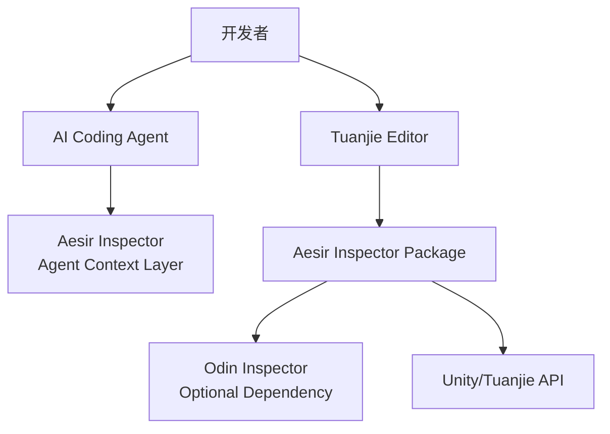
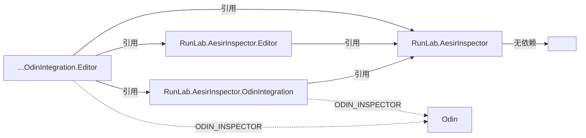
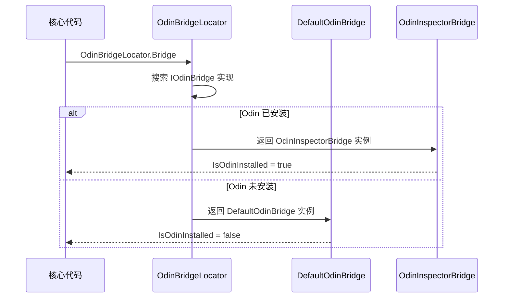
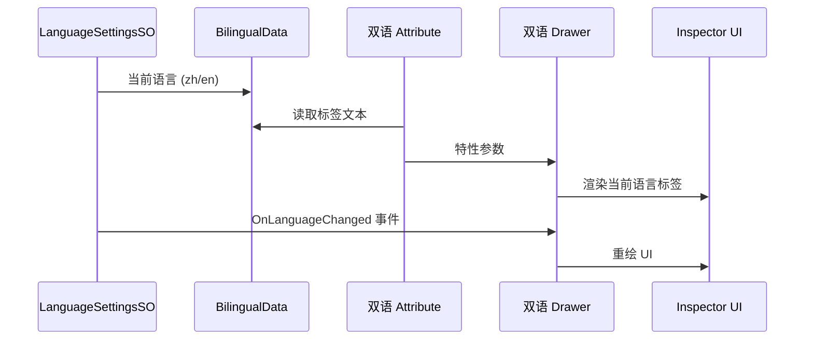

# Development Guide

> Aesir Inspector 开发者指南。面向 AI Agent 和贡献者的架构、约定与操作参考。

---

## Architecture

### System Context



### Assembly Dependency



### OdinBridge Data Flow



### Bilingual System Data Flow



---

## Conventions

### Naming

| 标识符 | 规则 | 示例 |
|---|---|---|
| 类、接口 | `PascalCase`，接口 `I` 前缀 | `PlayerManager`, `IDamageable` |
| 私有非序列化字段 | `_camelCase` | `_health` |
| 序列化字段 `[SerializeField]` | `camelCase` | `moveSpeed` |
| 常量 / 静态只读 | `PascalCase` | `MaxScore` |

### Enum

- 普通：含 `None = 0`，显式赋值。
- Flags：`[Flags]`，值为 `1 << n`，复合用 `|`。

### Unity 禁忌

- **严禁**对 `UnityEngine.Object` 派生类使用 `?.` / `??`
- **严禁**在 `Update` 中调用 `GetComponent`、`Find`、字符串拼接、LINQ

### Events

| 角色 | 命名 | 示例 |
|---|---|---|
| 事件 | 无 `On` 前缀 | `DoorOpened` |
| 订阅方法 | `On` + 事件名 | `OnDoorOpened` |
| 触发方法 | `Raise` + 事件名 | `RaiseDoorOpened` |

### Comments

- 公共类型**必须同时**具备 `/// <summary>` 和 `[Summary("...")]`
- 公共方法/属性/事件：注释可选，仅不直观时添加
- XML 仅保留 `<summary>`，移除 `<param>` / `<returns>`
- 公共构造函数无需注释

### Methods

- `Internal_` 前缀：私有/保护/内部方法与公开方法重名时使用

### Odin Inspector 规范

- Odin 依赖代码**必须**放在 `Odin Integration/` 子目录
- Processor：`internal sealed`，与目标类**同文件**定义，无需 XML / `[Summary]`
- Processor 需 `nameof` 引用私有成员时，定义为**嵌套类**（仍 `internal`）
- Drawer：继承 `OdinAttributeDrawer`，独立存于 `Drawers/` 目录

### Utility Naming

| 类别 | 命名规则 | 目录 | 示例 |
|---|---|---|---|
| Runtime | `XxxUtility` | `Runtime/Unity/Utilities/` | `PathUtility` |
| Editor 安全封装 | `XxxSafeEditorUtility` | `Runtime/Unity/Utilities/` | `HierarchySafeEditorUtility` |
| Editor-Only | `XxxEditorUtility` | `Editor/Unity/` | `PackageManagerEditorUtility` |

### SafeEditorUtility Pattern

```csharp
public static class XxxSafeEditorUtility
{
    // void 方法：构建剔除
    [Conditional("UNITY_EDITOR")]
    public static void PingObject(Object target) { /* Editor 实现 */ }

    // 有返回值方法：双实现
    public static bool TryGetAssetPath(Object target, out string path)
    {
#if UNITY_EDITOR
        path = AssetDatabase.GetAssetPath(target);
        return !string.IsNullOrEmpty(path);
#else
        path = default;
        return false;
#endif
    }
}
```

### Event Subscription

```csharp
// 先 - 再 +，防止重复
AesirInspectorLanguageSettingsSO.OnLanguageChanged -= Internal_OnLanguageChanged;
AesirInspectorLanguageSettingsSO.OnLanguageChanged += Internal_OnLanguageChanged;

// OnDestroy 中取消
AesirInspectorLanguageSettingsSO.OnLanguageChanged -= Internal_OnLanguageChanged;
```

---

## Modules

### Runtime/Unity/ — Core Runtime

| Component | Directory | Key Types |
|-----------|-----------|-----------|
| Attributes | `Attributes/` | `SummaryAttribute` |
| Core | `Core/` | `AesirInspectorVersion`, `AesirInspectorPaths`, `AesirInspectorWebLinks`, `IAesirInspectorReset` |
| Inspector | `Inspector/` | `BilingualDisplayAsStringControl`, `BilingualHeaderControl`, `HorizontalSeparateControl` |
| Localization | `Localization/` | `BilingualData`, `AesirInspectorLanguageSettingsSO` |
| Logging | `Logging/` | `AesirInspectorLogger`, `AesirInspectorLoggerSettings` |
| OdinBridge | `OdinBridge/` | `IOdinBridge`, `DefaultOdinBridge`, `OdinBridgeLocator` |
| ScriptDocGenerator | `ScriptDocGenerator/` | `ITypeData`, `MemberData`, `FieldData`, `PropertyData`, `MethodData`, `ConstructorData`, `EventData`, `ParameterData`, `TypeData` |
| Utilities | `Utilities/` | `ScriptableObjectSafeEditorUtility`, `MonoScriptSafeEditorUtility`, `PathUtility`, `PathSafeEditorUtility`, `HierarchyUtility`, `HierarchySafeEditorUtility`, `ProjectSafeEditorUtility`, `UrlUtility`, `ReflectionUtility`, `PredefinedAssemblyUtility`, `PlayerLoopUtility`, `RegexUtility` |

### Editor/Unity/ — Core Editor

| Component | Directory | Key Types |
|-----------|-----------|-----------|
| Core | `Core/` | `AesirInspectorInstallationChecker`, `AesirInspectorMenuItems` |
| MiniTools | `MiniTools/` | `QuickCreateSOMenuItem` |
| SummaryTool | `SummaryTool/` | `XmlSummaryTool`, `XmlCodePart`, `SummaryToolMenuItems` |

### Runtime/Odin Integration/ — Odin Runtime

| Component | Directory | Key Types |
|-----------|-----------|-----------|
| Attributes | `Attributes/` | `BilingualTitleAttribute`, `BilingualButtonAttribute` 等 4 个双语特性 |
| OdinCodeHighlighter | `OdinCodeHighlighter.cs` | 语法高亮器运行时数据 |

### Editor/Odin Integration/ — Odin Editor

| Component | Directory | Key Types |
|-----------|-----------|-----------|
| AttributeOverviewPro | `AttributeOverviewPro/` | Data-Panel-Example 三件套架构 |
| AttributeProcessors | `AttributeProcessors/` | OdinAttributeProcessor 实现 |
| Bridge | `Bridge/` | `OdinInspectorBridge` |
| Drawers | `Drawers/` | 4 个双语 Drawer |
| ExtensionManager | `ExtensionManager/` | 一键安装/移除推荐包 |
| MiniTools | `MiniTools/` | MenuItem Viewer, Syntax Highlighter |
| ScriptDocGenerator | `ScriptDocGenerator/` | 文档生成器编辑器逻辑 |
| Windows | `Windows/` | Getting Started, Preferences |

---

## Architecture Decisions

### ADR-001: OdinBridge Separation

核心运行时通过 `IOdinBridge` 接口查询 Odin 可用性，不直接引用 Odin 类型。无 Odin 时 `DefaultOdinBridge` 提供默认实现，有 Odin 时 `OdinInspectorBridge` 提供增强实现。

### ADR-002: Bilingual Attribute + Drawer Separation

Attribute 只承载数据，Drawer 负责渲染逻辑，Processor 负责动态注入。新增双语特性只需创建 Attribute + Drawer（+ 可选 Processor）。

### ADR-003: Core/Integration Assembly Separation

核心程序集（`Runtime/Unity/`、`Editor/Unity/`）零 Odin 依赖；Odin Integration 程序集通过 `ODIN_INSPECTOR` 编译约束自动启用/禁用。

### ADR-004: SafeEditorUtility Pattern

Runtime 工具类使用 `XxxSafeEditorUtility` 模式：`void` 方法加 `[Conditional("UNITY_EDITOR")]`，有返回值方法用 `#if UNITY_EDITOR` 双实现。构建时自动剔除，零运行时开销。

---

## Task Guides

### Add Bilingual Attribute

1. **Attribute**: `Runtime/Odin Integration/Attributes/Bilingual{Name}Attribute.cs` — 命名 `Bilingual{OdinOriginalName}Attribute`，必须 `[DontApplyToListElements]`，公共类型需 `/// <summary>` + `[Summary]`
2. **Drawer**: `Editor/Odin Integration/Drawers/Bilingual{Name}AttributeDrawer.cs` — 继承 `OdinAttributeDrawer<TAttribute>`，读取 `AesirInspectorLanguageSettingsSO.CurrentLanguage`，无需 XML / `[Summary]`
3. **Processor** (可选): 与被处理类同文件，`internal sealed`，无需 XML / `[Summary]`
4. **AttributeOverviewPro** (可选): 创建 Data-Panel-Example 三件套

### Add Inspector Control

1. **文件**: `Runtime/Unity/Inspector/{Name}Control.cs`
2. **命名**: `{Purpose}Control`
3. **双语**: 使用 `BilingualData` + `AesirInspectorLanguageSettingsSO.CurrentLanguage`
4. **Editor 功能**: 通过 `SafeEditorUtility` 模式桥接

### Add Odin Drawer

1. **文件**: `Editor/Odin Integration/Drawers/{Name}Drawer.cs`
2. **继承**: `OdinAttributeDrawer<TAttribute>`
3. **双语**: 通过 `AesirInspectorLanguageSettingsSO` 获取当前语言，订阅 `OnLanguageChanged` 事件
4. **无需** XML / `[Summary]`

### Add OdinAttributeProcessor

1. **位置**: 与被处理类**同文件**，`internal sealed`
2. **无需** XML / `[Summary]`
3. **需 `nameof` 引用私有成员**: 定义为**嵌套类**（仍 `internal`）
4. **隐藏条件属性命名**: 集合为空 `{FieldName}IsEmpty`，对象为空 `{Target}IsNull`

### Add Utility

1. **Runtime 工具**: `XxxUtility` → `Runtime/Unity/Utilities/`
2. **Editor 安全封装**: `XxxSafeEditorUtility` → `Runtime/Unity/Utilities/`
3. **Editor-Only**: `XxxEditorUtility` → `Editor/Unity/`
4. **必须** `public static class`，私有方法加 `Internal_` 前缀
5. 日志使用 `AesirInspectorLogger`，Odin 操作通过 `OdinInspectorSafeEditorUtility` 桥接
